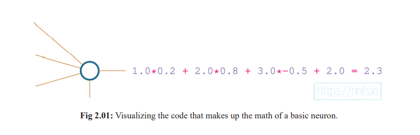
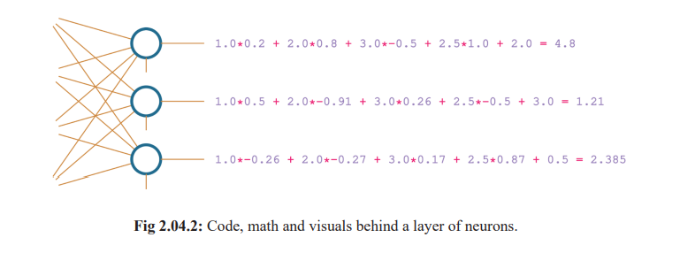
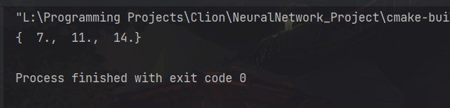
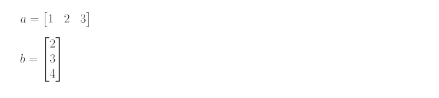
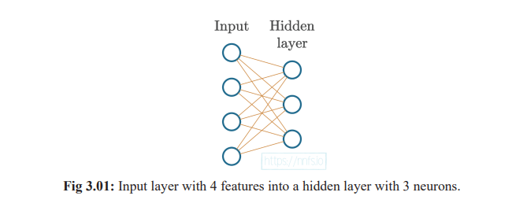

# Neural Networks

## A Single Neuron

Let’s say we have a single neuron, and there are three inputs to this neuron. As in most cases,
when you initialize parameters in neural networks, our network will have weights initialized
randomly, and biases set as zero to start. Why we do this will become apparent later on. The input
will be either actual training data or the outputs of neurons from the previous layer in the neural
network.



Here i tried to implement a single neuron:

```cpp
    // Coding a Single Neuron
    std::vector<int> inputs = {1,2,3};
    std::vector<double> weights  = {0.2,0.8,-0.5};
    auto bias = 2;
    double output = 0;
    for(int i=0;i<3;i++){
        output += inputs[i]*weights[i];
    }
    output += bias;
    std::cout << output << "\n";
```

Here input has only 1 weight associated with it.

The output of the following program is 2.3

## A Layer Of Neurons

Neural networks typically have layers that consist of more than one neuron. Layers are nothing more than groups of neurons. Each neuron in a layer takes exactly the same input—the input given to the layer (which can be either the training data or the output from the previous layer), but contains its own set of weights and its own bias, producing its own unique output. The layer’s output is a set of each of these outputs — one per each neuron. Let’s say we have a scenario with 3 neurons in a layer and 4 inputs:



i coded that as

```cpp
// Coding a Layer Of Neurons
    std::vector<double> inputs = {1,2,3,2.5};
    std::vector<std::vector<double>> weights  = {
            {0.2,0.8,-0.5,1},
            {0.5,-0.91,0.26,-0.5},
            {-0.26,-0.27,0.17,0.87}
    };
    std::vector<double> bias = {2,3,0.5};
    std::vector<double> output;
    for(int i=0;i<3;i++){
        double temp = 0;
        for(int j=0;j<4;j++){
            temp += inputs[j]*weights[i][j];
        }
        temp += bias[i];
        output.push_back(temp);
    }

    for(auto x:output){
        std::cout << x << " ";
    }
```

the output of the program is:


While Working on This Project i came across a c++ library called xtensor which will help in this project doing the mathematical heavy lifting its a modern cpp library inspired by numpy.

[Its Github Repo](https://github.com/xtensor-stack/xtensor)

I installed it using Vcpkg as it was convenient and simple enough to get started. Here is a simple xtensor code to add a array

```cpp
// trying xtensor
    xt::xarray<double> arr1{
            {1.0,2.0,3.0},
            {2.0, 5.0, 7.0},
            {2.0, 5.0, 7.0}
    };

    xt::xarray<double> arr2{5.0,6.0,7.0};

    xt::xarray<double> result = xt::view(arr1,1) + arr2;
    std::cout << result << std::endl;
```



it adds the 2nd Row of Arr1 to Arr1.

now to use it to make a single neuron

```cpp
 // coding a single neuron with xtensor
 xt::xarray<double> inputs {1,2,3};
 xt::xarray<double> weights {0.2,0.8,-0.5};
 double bias = 2.0;
 auto option = xt::linalg::dot(inputs,weights) + bias;
 std::cout << option << "\n";
```

when implementing a layer of neurons in to my program using xtensor i faced some problem and decided to use another library instead of working with it a it was a design problem and xtensor uses some advance concepts that i am not ready to tackle yet.

So i used armadillo instead the good old linear algebra library to help me here, i could have used the boost library that would help me learn to use boost also but i stuck with armadillo till i face my next problem.

So heres a implementation of a layer of nurons this time using armadillo:

```cpp
// Code a Layer of neurons
  arma::mat inputs = {1.0,2.0,3.0,2.5};
  arma::mat weights(3,4);
  weights = {
          {0.2,0.8,-0.5,1},
          {0.5,-0.91,0.26,-0.5},
          {-0.26,-0.27,0.17,0.87}
  };
  arma::mat biases = {2.0,3.0,0.5};
  arma::mat output(1,3);
  for(int i=0;i<3;i++){
     output(i) = arma::dot(inputs,weights.row(i)) + biases(i);
  }
  std::cout << output << "\n";
```

## A Batch of Data

To Train, neural networks tend to receive data in batches. So far we have 1D input array. If we imagine each number as a value from different sensor. We can have a set of these also called observations or commonly known as a sample.

often our network is expected to take in many samples at a time. It is faster to train in batches in parallel processing and batches help with generalization during training.

So Now We have a matrix of inputs and a matrix of weights now and we need to perform dot product on them. As We performed a dot product on a matrix and a vector we treated the matrix as a list of vectors resulting in a list of dot products. Now We need to manage both  matrices as a lists of vector and perform dot product on all of them in all combinations resulting in a lists  of output matrix. This is called the matrix product.

### Matrix Product

To Perform a matrix product of nxm matrix the m1==n2 should be true.



Here a dimensions (1x3)

     b dimensions (3x1)

So m1 == n2

Thus We can do Matrix Product

And it should be

$$
a.b = 1*2 + 2*3 + 3*4
    = 2 + 6 + 12
    = 20
$$

The Relation between Dot Product and a matrix product is

$$
\vec {a}. \vec {b} = ab^T
$$

```cpp
arma::mat a {1,2,3};
arma::mat b {2,3,4};
auto c = arma::dot(a,b.t());
std::cout << c << std::endl;
```

As we can see, to perform a matrix product on two vectors, we took one as is, transforming it into 
a row vector, and the second one using transposition on it to turn it into a column vector. That allowed us to perform a matrix product that returned a matrix containing a single value. We also performed the matrix product on two example arrays to learn how a matrix product works — it creates a matrix of dot products of all combinations of row and column vectors.

## A Layer Of Neurons & Batch Data w/ Armadillo

```cpp
// Code a Layer of neurons
    arma::mat inputs = {
            {1.0,2.0,3.0,2.5},
            {2.0,5.0,-1.0,2.0},
            {-1.5,2.7,3.3,-0.8}
    };

    arma::mat weights = {
            {0.2,0.5,-0.26},
            {0.8,-0.91,-0.27},
            {-0.5,0.26,0.17},
            {1.0,-0.5,0.87}
    };

    arma::mat biases {2.0,3.0,0.5};
    arma::mat output(3,3);

    for(int i=0;i<3;i++){
        for(int j=0;j<3;j++){
            output(i,j) = arma::dot(inputs.row(i),weights.col(j));
        }
        output.row(i) += biases;
    }

    std::cout << output << std::endl;
```

### Adding Layers

The Previous Example Has only one layer of data.

Now We Will try to add more layers.


